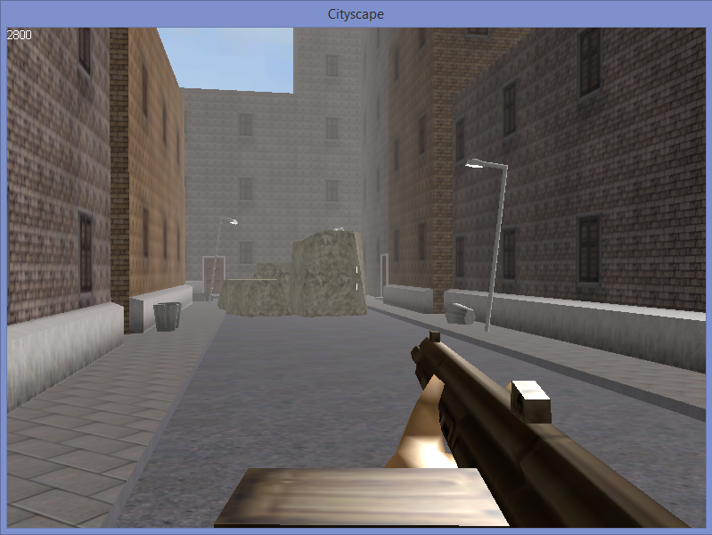

[![Code quality][codacy-svg]][codacy]

# VYGE

[codacy-svg]:        https://app.codacy.com/project/badge/Grade/a6117ceba9e64b42b7c0f45d7d7c9669

[codacy]:            https://app.codacy.com/gh/matt77hias/VYGE/dashboard?utm_source=gh&utm_medium=referral&utm_content=&utm_campaign=Badge_grade

## About
Vaughan Young's Game Engine (VYGE) and FPS game made ready for building on recent Visual Studio 2017.

## Development
* **Platform**: Windows 10 32 Bit (Windows API + DirectX 9)

**Note**: Building the code for 64 Bit results in some pointer conversions between 32 Bit primitives and 64 Bit pointers which is dangerous. To avoid these issues and since I do not want to modify the original code (to keep it as a reference), I removed the 64 Bit build completely from the solution.

## Before building
1. Install [Microsoft DirectX SDK (June 2010)](https://www.microsoft.com/en-us/download/details.aspx?id=6812). I tested using Microsoft DirectX 9.0 SDK (October 2004) which does not seem to be directly available from Microsoft anymore. (*I still have an installer but unfortunately the file is too big to upload to Github.*)
2. Set the environment variable `DXSDK_DIR9` to the installation directory of the DirectX SDK.
  1. Go to `This PC`
  2. Right click
  3. Select `Properties`
  4. Select `Advanced system settings`
  5. Click on the `Environment Variables` button
  6. Add `DXSDK_DIR9` in the list of `System Variables` and set it to the installation directory of the DirectX SDK.
  
**Note**: you need to position the *Assets* directory in your execution directory to be able to play the game. Make sure the .txt files have `CRLF` (Windows) instead of `LF` (Unix) line endings!

## Bibliography
YOUNG V.: Programming a Multiplayer FPS in DirectX, 1st edition, Game Development Series, Charles River Media, Hingham, Massachusetts, USA, 2005.
